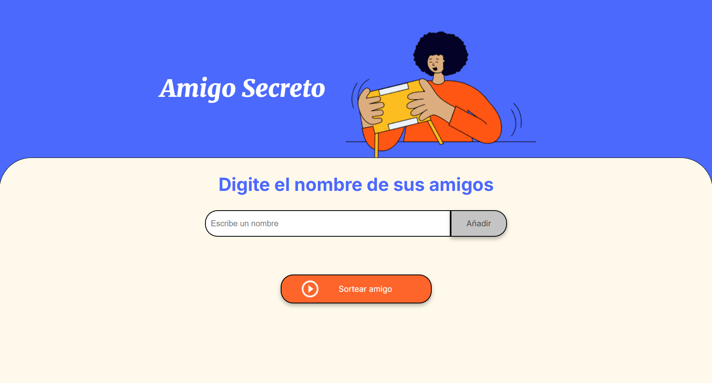

# Amigo Secreto 🎁  

Proyecto desarrollado en el curso **Oracle Next Education (ONE) + Alura Latam**. 

## Descripción  

Aplicación web que permite ingresar nombres en una lista y realizar un sorteo aleatorio para determinar quién es el "amigo secreto".  

## Funcionalidades  

- ✅ Agregar nombres a la lista.  
- ✅ Validar que la entrada no esté vacía.  
- ✅ Visualizar la lista en pantalla.  
- ✅ Realizar un sorteo aleatorio.  
- ✅ Reiniciar la lista para un nuevo sorteo.